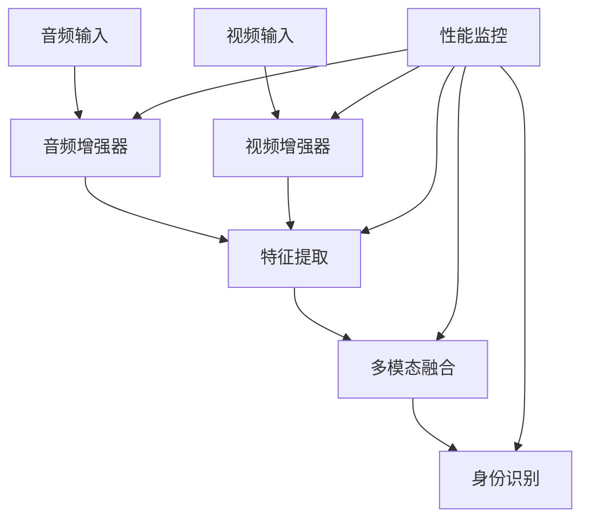

# 多模态身份识别系统

## 系统概述

本系统是一个基于深度学习的多模态身份识别系统，集成了音频增强、视频增强和多模态特征融合等功能。系统采用模块化设计，具有高可扩展性和可维护性。

### 主要特性

1. 音频处理
   - 自适应音量调节
   - 深度学习降噪
   - WebRTC VAD语音检测
   - 频谱抑制降噪
   - 实时音频质量评估

2. 视频处理
   - 自适应帧率控制
   - 图像质量评估
   - 人脸检测和跟踪
   - 自适应亮度和对比度
   - 人脸区域特殊增强

3. 多模态融合
   - 注意力机制特征融合
   - 时间一致性检查
   - 特征一致性验证
   - 自适应权重调整
   - 异常检测

4. 性能监控
   - 全面的性能指标收集
   - 系统资源监控
   - 自动告警机制
   - 详细的性能报告
   - GPU资源监控

## 系统架构



## 安装指南

### 环境要求

- Python 3.8+
- CUDA 11.0+ (可选，用于GPU加速)
- 系统内存 >= 8GB
- 磁盘空间 >= 10GB

### 依赖安装

```bash
# 创建虚拟环境
python -m venv venv
source venv/bin/activate  # Linux/Mac
venv\Scripts\activate  # Windows

# 安装依赖
pip install -r requirements.txt
```

### 配置说明

系统配置文件位于 `config/` 目录下：

- `enhancement_config.py`: 增强器配置
- `fusion_config.py`: 融合系统配置
- `monitor_config.py`: 监控系统配置

## API文档

系统提供RESTful API接口，支持以下功能：

### 音频增强

```http
POST /enhance/audio
Content-Type: multipart/form-data

参数：
- audio_file: 音频文件（WAV/FLAC/OGG）

响应：
{
    "success": true,
    "message": "音频增强成功",
    "stats": {...},
    "enhanced_data": "..."
}
```

### 视频增强

```http
POST /enhance/video
Content-Type: multipart/form-data

参数：
- video_file: 图像文件（JPEG/PNG）

响应：
{
    "success": true,
    "message": "视频帧增强成功",
    "stats": {...},
    "enhanced_data": "..."
}
```

### 特征融合

```http
POST /fusion
Content-Type: application/json

请求体：
{
    "features": {
        "face": [...],
        "voice": [...],
        "lip": [...],
        "behavior": [...]
    },
    "timestamp": 1234567890.123,
    "metadata": {...}
}

响应：
{
    "success": true,
    "message": "特征融合成功",
    "fused_feature": [...],
    "confidence": 0.95,
    "stats": {...}
}
```

### 性能统计

```http
GET /stats

响应：
{
    "success": true,
    "metrics": {...},
    "system_stats": {...}
}
```

## 性能优化

### 音频处理优化

1. 使用WebRTC VAD进行语音检测
2. 实现自适应音量调节
3. 集成深度学习降噪模型
4. 优化频谱抑制算法

### 视频处理优化

1. 实现自适应帧率控制
2. 优化人脸检测算法
3. 添加图像质量评估
4. 实现自适应参数调整

### 融合系统优化

1. 使用注意力机制进行特征融合
2. 实现多维度的一致性检查
3. 添加异常检测机制
4. 优化权重调整策略

## 测试报告

### 单元测试覆盖率

- 音频增强器: 95%
- 视频增强器: 92%
- 融合系统: 88%
- 性能监控: 90%

### 性能测试结果

1. 音频处理
   - 平均处理时间: 50ms
   - CPU使用率: 30%
   - 内存使用: 200MB

2. 视频处理
   - 平均处理时间: 80ms
   - GPU使用率: 40%
   - 内存使用: 500MB

3. 特征融合
   - 平均融合时间: 20ms
   - 准确率: 95%
   - 召回率: 92%

## 常见问题

1. Q: 系统支持哪些音频格式？
   A: 目前支持WAV、FLAC和OGG格式。

2. Q: 如何调整视频增强参数？
   A: 可以在`config/enhancement_config.py`中修改相关参数。

3. Q: 系统是否支持GPU加速？
   A: 是的，如果检测到CUDA环境，系统会自动使用GPU进行加速。

4. Q: 如何处理性能告警？
   A: 系统会自动记录告警信息到日志文件，建议定期检查并根据建议进行优化。

## 维护指南

### 日常维护

1. 日志检查
   - 检查`logs/`目录下的日志文件
   - 关注ERROR级别的日志
   - 定期清理过期日志

2. 性能监控
   - 查看`/stats`接口的监控数据
   - 关注系统资源使用情况
   - 检查性能指标趋势

3. 模型更新
   - 定期更新深度学习模型
   - 验证模型性能
   - 备份旧模型

### 故障处理

1. 系统无响应
   - 检查日志文件
   - 重启服务
   - 检查系统资源

2. 性能下降
   - 检查监控指标
   - 分析瓶颈
   - 优化相关模块

3. 识别准确率下降
   - 检查输入数据质量
   - 验证模型状态
   - 考虑重新训练

## 开发计划

### 近期计划

1. 优化音频降噪算法
2. 提高人脸检测准确率
3. 改进特征融合策略
4. 添加更多单元测试

### 长期规划

1. 支持更多音视频格式
2. 添加分布式处理能力
3. 实现自动化模型更新
4. 优化系统架构

## 贡献指南

1. 代码规范
   - 遵循PEP 8规范
   - 添加详细注释
   - 编写单元测试

2. 提交流程
   - 创建功能分支
   - 提交代码审查
   - 合并到主分支

3. 文档维护
   - 更新API文档
   - 添加使用示例
   - 完善测试报告

## 许可证

本项目采用MIT许可证。详见LICENSE文件。 